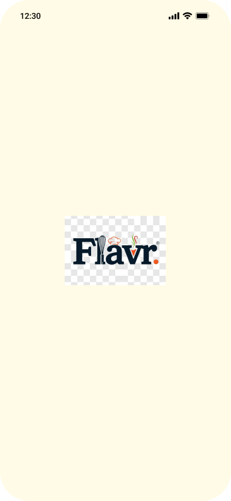
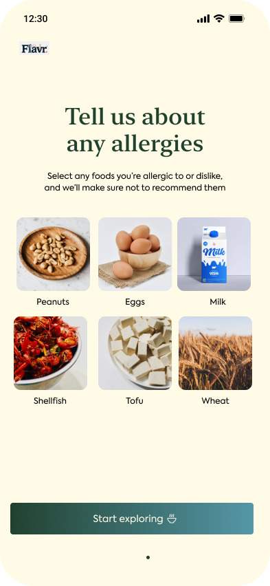
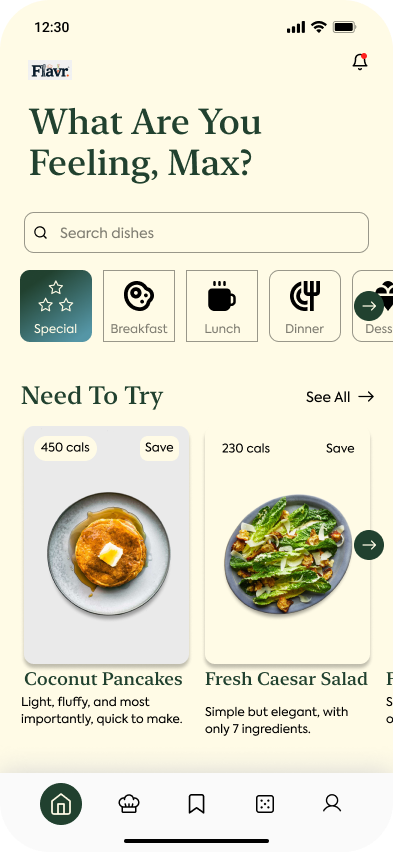
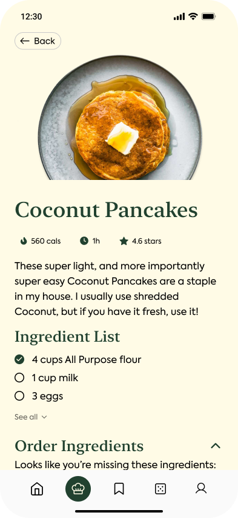

# 🍓 Flavr – Recipe App UI/UX

A beautifully crafted **Recipe App UI/UX** design built with a focus on simplicity, elegance, and user-friendliness.
Explore recipes, discover new dishes, and enjoy a clean, flavourful interface.

---

## 🌟 Preview

| Logo | Start Screen | Home Screen | Recipe Screen |
|------|---------------|--------------|----------------|
|  |  |  |  |


---

## 🎨 Design Overview

Flavr is a modern recipe app concept emphasizing:

* Minimalistic and engaging **visual design**
* Smooth **user flow** for browsing and saving recipes
* Eye-catching **color palette** and typography

---

## 🧩 Tools Used

* **Figma** – UI/UX Design
* **Photoshop / Photopea** – Image and icon creation
* **GitHub** – Project hosting and version control

---

## 🔗 Useful Links

* 🎨 [View Full Design on Figma](https://www.figma.com/design/FEdjgUAdvqROX1ou3BEJnR/Flavr?node-id=0-1&t=TYdJtCgdtS2BCK9P-1)
* 💼 [Connect with me on LinkedIn](https://www.linkedin.com/in/takshay-kumar-55a25525b?utm_source=share&utm_campaign=share_via&utm_content=profile&utm_medium=android_app)
* 🧠 [Explore my GitHub Projects](https://github.com/takshaykr)

---

## 👨‍🎨 Designer & Developer

**Takshay Kumar**
Game Development Student | UI/UX Enthusiast | Creative Thinker

---

## 📁 Folder Structure

```
Flavr-Recipe-App-UIUX/
│
├── Screenshots/
│   ├── Home.png
│   ├── Logo.png
│   ├── Recipe.png
│   ├── Start.png
│   └── placeholder.txt
│
└── README.md
```

---

## ⭐ Show Support

If you liked this design, **star** ⭐ the repository to show your support!

---

Would you like me to make it more **modern and colorful with emojis and badges (like Figma badge, LinkedIn icon, etc.)** — or keep it **minimal and professional** like this?
